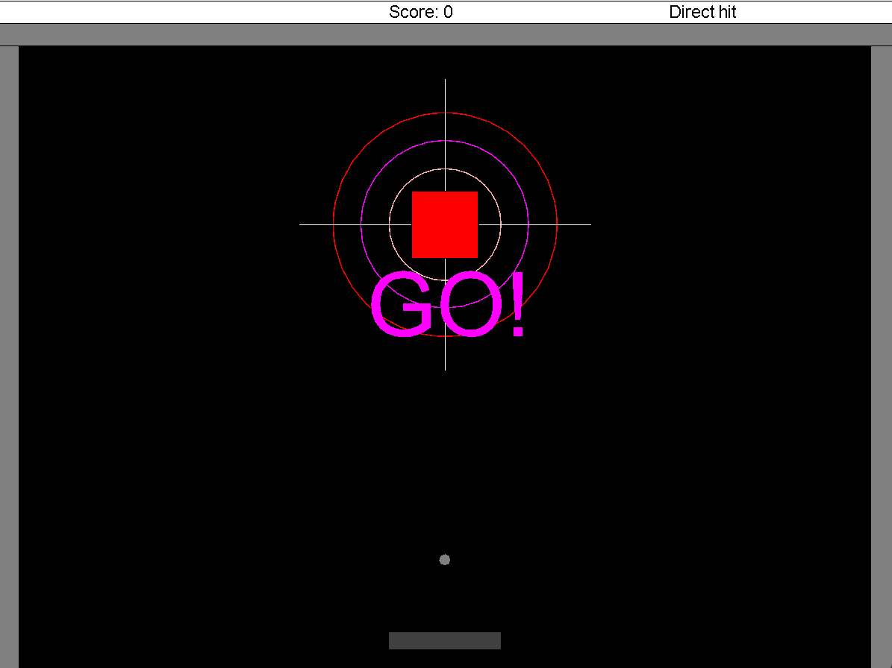
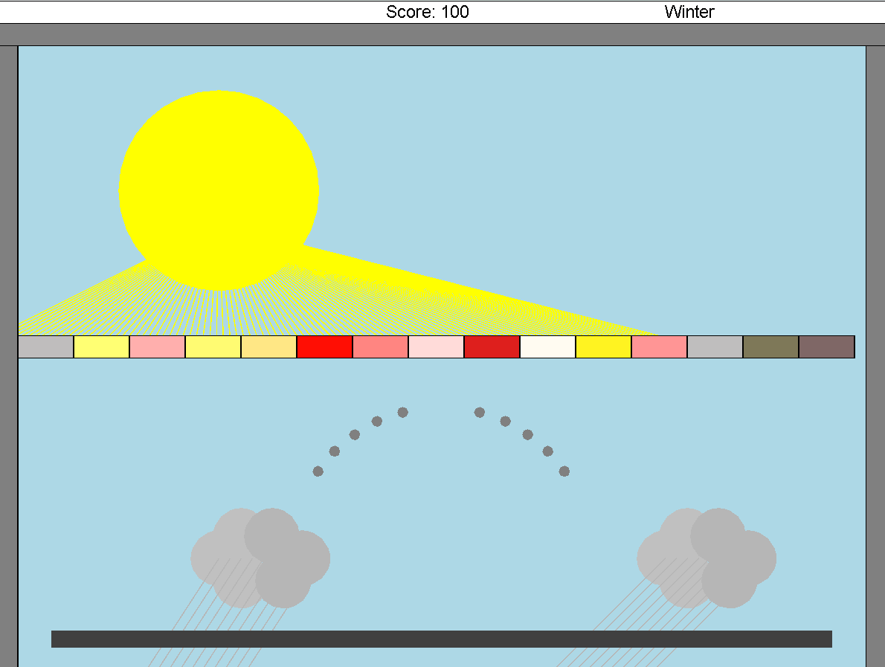
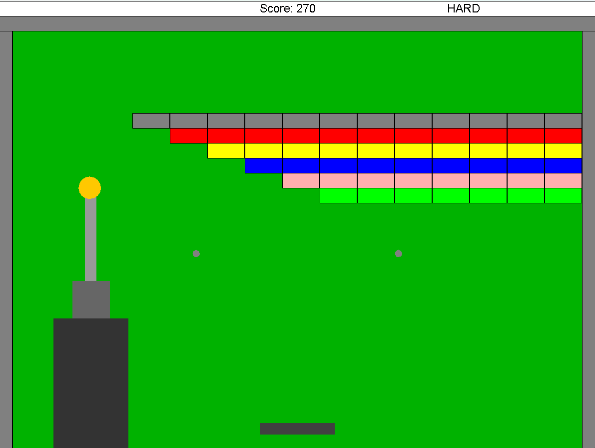
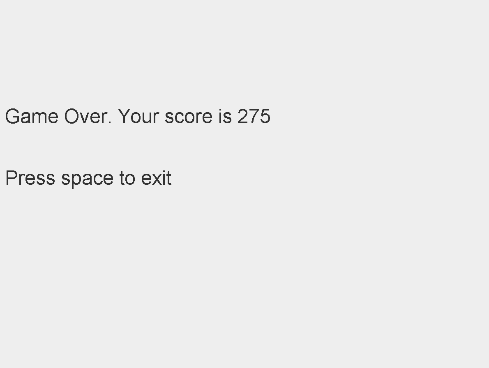

# Breakout Arcade Game

## 🎮 Overview
This project is a **Breakout-style arcade game** implemented in Java. The game challenges players to break bricks using a bouncing ball and a paddle. It features:
- Multiple levels with increasing difficulty
- Real-time physics interactions
- Smooth animations
- Score tracking and game-over conditions
- Pause and end screens

## 🛠️ Installation & Setup

### 1️⃣ **Clone the Repository**
```sh
git clone https://github.com/YOUR_USERNAME/BreakoutArcade.git
cd BreakoutArcade
```

### 2️⃣ **Compile the Project**
Ensure you have **Java** installed and run:
```sh
javac -d bin -cp "biuoop-1.4.jar;src" -sourcepath src src/Ass6Game.java
```

### 3️⃣ **Run the Game**
```sh
java -cp "bin;biuoop-1.4.jar" Ass6Game
```

## 📂 Project Structure
```
BreakoutArcade/
│── src/
│   ├── Ass6Game.java  # Main game entry
│   ├── gui/animation  # Handles game animations
│   ├── gui/environments # Game environment and physics
│   ├── gui/graphics   # Drawing utilities (Point, Rectangle, etc.)
│   ├── gui/levels     # Game levels & backgrounds
│── bin/  # Compiled class files
│── biuoop-1.4.jar  # External library for UI handling
│── README.md  # Project documentation
```

## 🎯 Game Instructions
- **Use Left/Right Arrow Keys** to move the paddle.
- **Press Space** to launch the ball.
- **Break all the bricks** to clear a level.
- **Press P** to pause the game.
- **Game Over** if the ball falls below the paddle.

## 💻 Technologies Used
- Java (Object-Oriented Programming)
- biuoop Library (for GUI and animations)
- Event-driven programming for user interactions

## 🖼️ Screenshots

### 🎮 First Level Screen


### 🎮 Second Level Screen


### 🎮 Third Level Screen


### 🏆 Game Over Screen



---
Made with ❤️ in Java. Enjoy the game! 🎮

